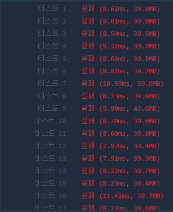

# ✔ 땅따먹기
## 📌 LEVEL 2
### 🔸 DP(동적계획법)
- 참고 : https://developer-mac.tistory.com/77
### 🔸 풀이방법
- 이문제로 고통을 많이 받았다.. 다시 정리.. 필요
- 계산에는 아무문제없는데 시간복잡도에서 오래걸려 테스트를 통과하지못했다..
- 줄이고 줄여 이정도.. 3번정도 수정하였지만 통과하지 못했다.

<pre>
function solution(land) {
    let answer = 0;
    const row = 4;
    for (let i = 0; i < row; i++) {
        let sumArr = 0;
        let indexNumber = 0;
        for (const j in land) {
            if (j == 0) {
                sumArr += land[j][i];
                indexNumber = i;
            } else {
                const maxValue = land[j].filter((val, idx) => idx !== indexNumber)
                                        .reduce((pre, current) => pre > current ? pre : current);
                indexNumber = land[j].findIndex(val => val === maxValue);
                sumArr += maxValue;
            }
        }
        if (answer < sumArr) {
            answer = sumArr;
        }
    }
    return answer;
}
</pre>
- 질문하기와 온라인을 도움을 받아 DP로 풀어야한다는 사실을 깨달았다. 
- DP 공부를 더해야할듯하다.
<pre>
0: (4) [1, 2, 3, 5]               : [2]
1: (4) [10, 11, 12, 103(3+100)]   : [4]
2: (4) [107(4+103), 106, 105, 13] : [1]
</pre>