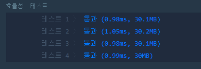

# ✔ 최솟값 만들기
## 📌 LEVEL 2
### 🌈 문제 풀이
- 간단한 문제라 딱히 풀이가 없다.
- 받은 배열 A, B를 A는 내림차순으로 B는 오름차순으로 정렬한다.
- 그 후, A의 인덱스 자리와 B의 같은 인덱스 번호의 값과 곱해준 뒤 합한 결과를 반환해준다.

#### 📚 다른 풀이
- 역시 `reduce` 조금은 복잡하지만 알면 편리한 배열 메서드
- `forEach` 보다 나은거 같긴 한데 그게 그거같다.

```javascript
function solution(A,B){
    A.sort((a, b) => a - b)
    B.sort((a, b) => b - a)
    return A.reduce((total, val, idx) => total + val * B[idx], 0)
}
```

#### 🤔 효율성 테스트 결과
- `forEach`


- `reduce`



- 흠 `forEach`가 좀 더 빠른건가..


---

📌 문제 출처 : https://programmers.co.kr/learn/courses/30/lessons/12941?language=javascript