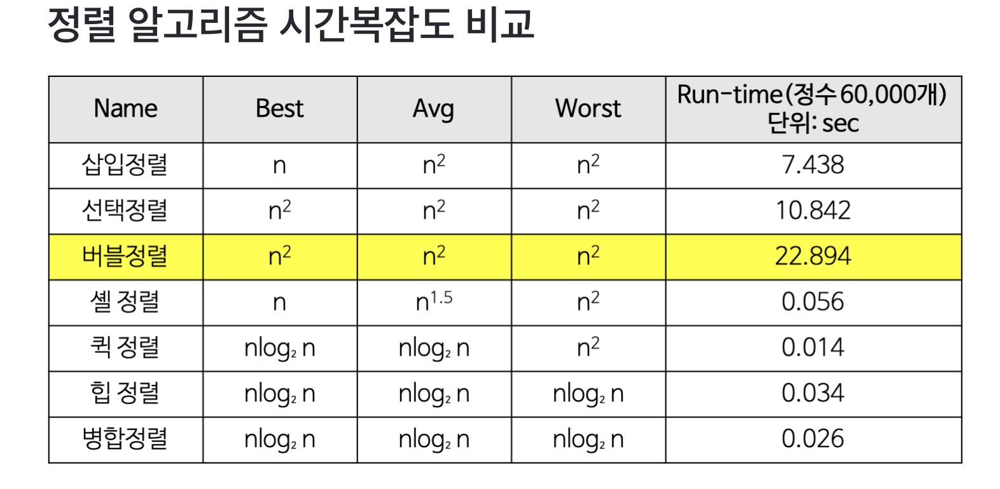

## 🦄 정렬과 그리디, 결정알고리즘

### 🎈 목표
- TDD 사이클을 기반으로 문제를 푼다.

#### [🤔 선택 정렬](https://github.com/saseungmin/daily_coding_dojo/tree/master/inflearn_algorism/section7/solution1)

#### [🤔 버블 정렬](https://github.com/saseungmin/daily_coding_dojo/tree/master/inflearn_algorism/section7/solution2)

#### [🤔 Special Sort(구글 인터뷰)](https://github.com/saseungmin/daily_coding_dojo/tree/master/inflearn_algorism/section7/solution3)

