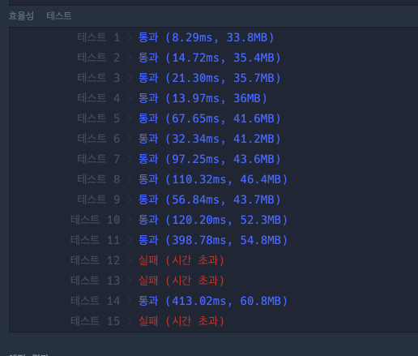
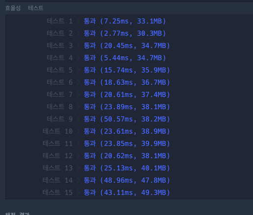
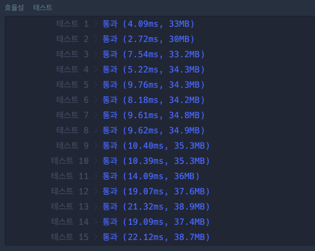

# ✔ 보석 쇼핑

## 🌈 LEVEL 3

### ✌ 2020 카카오 인턴쉽

### ✌ 풀이 방법
- 투포인트 알고리즘
- 정확성과 효율성 테스트 각각 점수가 있는 문제로 정확성은 간단하게 해결할 수 있는 문제지만 효율성에서 애를 먹었다.
- 여러가지 방법을 거쳤고 `Map`의 `values().next()`라는 이터레이터를 반환하는 걸 알게되었다.
- 단지 첫번째 값만 필요했기 때문에 `values().next().value`로 첫번째 위치의 값만 찾기에 속도가 압도적으로 빨랐다.
- 원래 다음과 같이 했는데 효율성에 실패하였다.

```js
const sortByDistance = (gems) => gems.sort((a, b) => {
  const subtractA = a[1] - a[0];
  const subtractB = b[1] - b[0];

  if (subtractA === subtractB) {
    return a[1] - b[1];
  }

  return subtractA - subtractB;
});

function solution(gems) {
  const answer = [];

  const { size } = new Set(gems);
  const gemMap = new Map();

  for (let i = 0; i < gems.length; i++) {
    const gem = gems[i];

    gemMap.delete(gem);
    gemMap.set(gem, i);

    if (size === gemMap.size) {
      // 모든 Map을 배열로 변환해 첫번째 인덱스의 값과 마지막 인덱스의 값을 찾았다.
      const selectedGem = [...gemMap.values()];
      
      answer.push([selectedGem[0] + 1, selectedGem[selectedGem.length - 1] + 1]);
    }
  }

  return sortByDistance(answer)[0];
}
```

- 다음과 같은 시간이 소요되었고 실패했다.




- 그 뒤 저 부분을 `values().next()`로 변경하였다.

```js
function solution(gems) {
  const answer = [];

  const { size } = new Set(gems);
  const gemMap = new Map();

  for (let i = 0; i < gems.length; i++) {
    const gem = gems[i];

    gemMap.delete(gem);
    gemMap.set(gem, i);

    if (size === gemMap.size) {
        answer.push([gemMap.values().next().value + 1, i + 1]);
    }
  }

  return sortByDistance(answer)[0];
}
```

- 효율성 테스트에 성공하였다.



- 하지만, 정렬해주는 부분이 마음에 들지 않았고 더 줄일 수 있을거 같았다.
- 그래서 다음과 같이 `size`가 같을 때 해당 로직에 일치할때 배열에 `push` 해주는것이 아닌 값을 변경해주게만 하였다.

```js
function solution(gems) {
  // 배열의 길이가 100000만
  let answer = [0, 100000];

  const { size } = new Set(gems);
  const gemMap = new Map();

  for (let i = 0; i < gems.length; i++) {
    const gem = gems[i];

    if (gemMap.has(gem)) {
      gemMap.delete(gem);
    }
    gemMap.set(gem, i);

    if (size === gemMap.size) {
      const firstValue = gemMap.values().next().value;
      // 현재 제일 작은 두 사이의 값의 차 
      const min = answer[1] - answer[0];
      // 새로 찾은 두 사이의 값의 차
      const target = (i + 1) - (firstValue + 1);

      // 만약 새로 찾은 값이 현재 제일 작은 값보다 작거나
      // 둘이 같고 시작 값이 현재 제일 작은 값의 시작 값보다 새로 찾은 시작 값이 더 작을 경우
      if (min > target || (min === target && answer[0] > firstValue + 1)) {
        answer = [firstValue + 1, i + 1];
      }
    }
  }

  return answer;
}
```

- 위와 같이 정렬 로직을 제거해주니 확연히 시간복잡도가 줄어들었다.



- 참고로 `for`와 `forEach`를 비교해봤는데 역시 `for`문이 더 빨랐다.

<hr>

📌 문제 출처 : https://programmers.co.kr/learn/courses/30/lessons/67258
